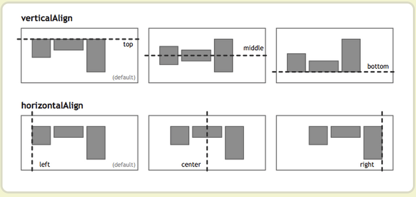

# flex 布局教程：实例

[toc]

> 参考：阮一峰的网络日志
>
> 1. Flex 布局教程：语法篇 <a>https://www.ruanyifeng.com/blog/2015/07/flex-grammar.html<a/>
>
> 2. Flex 布局教程：实例篇 <a>https://www.ruanyifeng.com/blog/2015/07/flex-examples.html<a/>
>
>    

# 实例篇

## 一、骰子的布局

