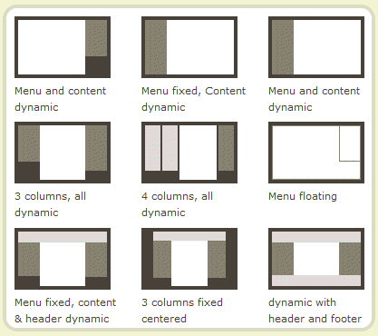
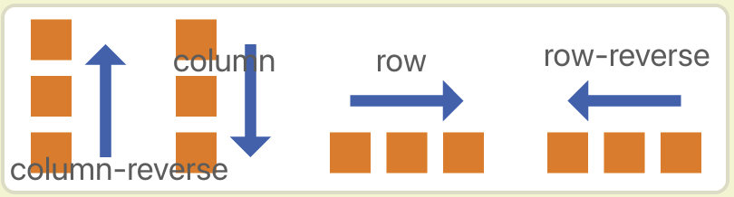
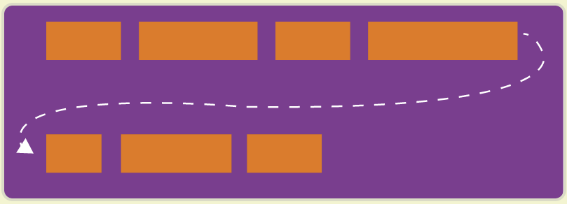
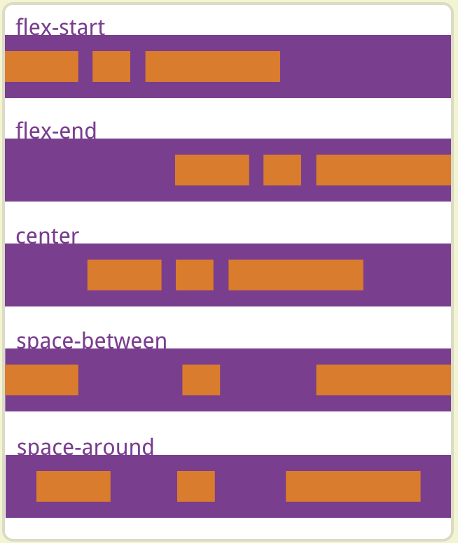
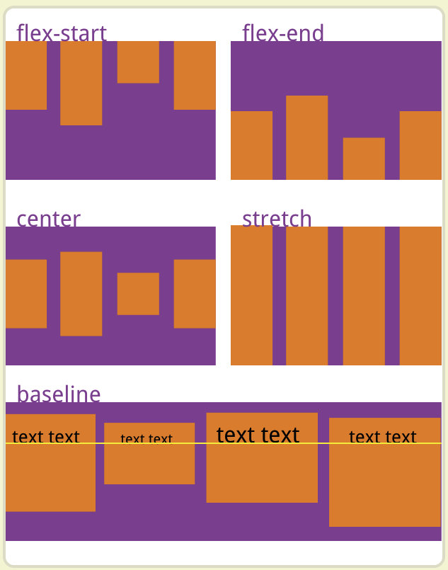
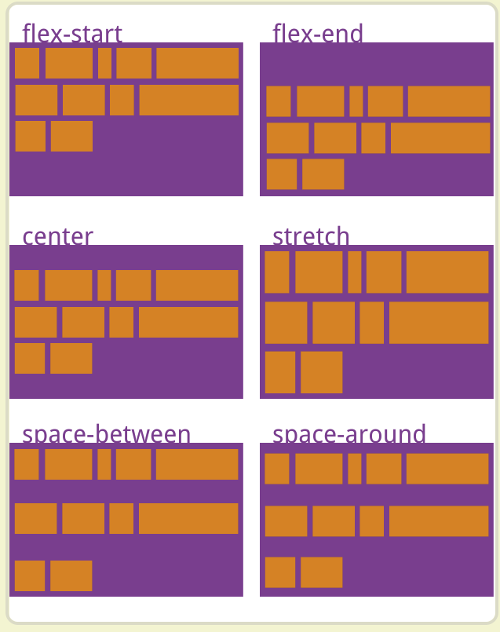
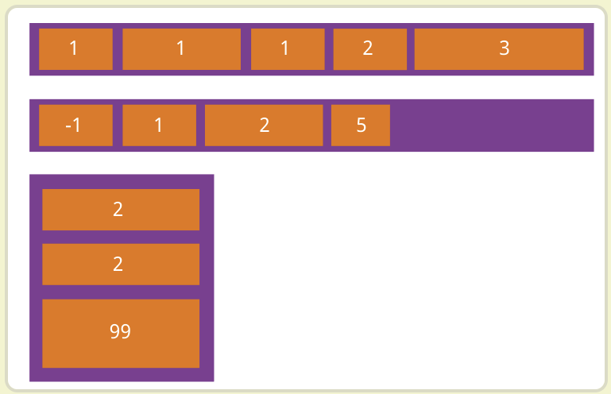
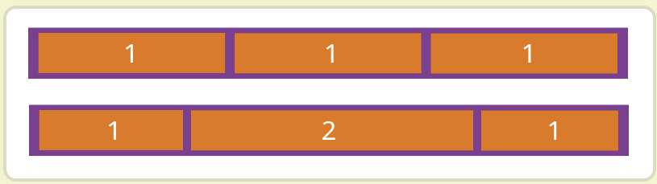
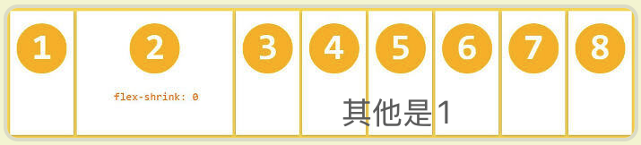
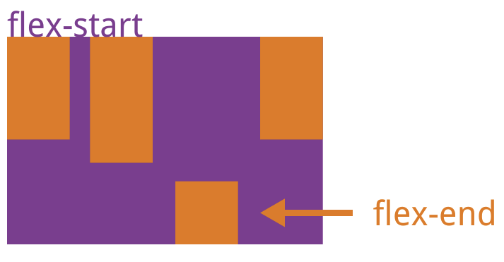

# flex 布局教程：语法

[toc]

> 参考：阮一峰的网络日志
>
> 1. Flex 布局教程：语法篇 <a>https://www.ruanyifeng.com/blog/2015/07/flex-grammar.html<a/>
>
> 2. Flex 布局教程：实例篇 <a>https://www.ruanyifeng.com/blog/2015/07/flex-examples.html<a/>
>
>    

# 语法篇

> 2009年，W3C 提出了一种新的方案----Flex 布局
>
> Flex 是 **Flexible Box** 的缩写，意为"弹性布局"，用来为盒状模型提供最大的灵活性。

⚠️ 设为 Flex 布局以后，子元素的`float`、`clear`和`vertical-align`属性将失效。

> 采用 Flex 布局的元素，称为 Flex 容器（flex container），简称"容器"。它的所有子元素自动成为容器成员，称为 Flex 项目（flex item），简称"项目"。

## 容器的属性

```css
1. flex-direction
2. flex-wrap
3. flex-flow
4. justify-content
5. align-items
6. align-content
```

### 1. flex-direction

属性决定主轴的方向（即项目的排列方向）。

```css
.box {
  flex-direction: row | row-reverse | column | column-reverse;
}
```



### 2. flex-wrap

- 默认情况：items都排列在一条轴线上⬇️
- `flex-wrap`属性定义：如果一条轴线排不下，如何换行。



```css
.box{
  flex-wrap: nowrap | wrap | wrap-reverse;
}

nowrap: 不换行
wrap: 换行
wrap-reverse: 换的新行在上方
```

### 3. flex-flow

`flex-flow`属性是`flex-direction`属性和`flex-wrap`属性的简写形式，默认值为`row ｜ nowrap`。

```css
.box {
  flex-flow: <flex-direction> || <flex-wrap>;
}
```

### 4. justify-content⭐️

定义了items在**主轴上**的对齐方式

```css
.box {
  justify-content: flex-start | flex-end | center | space-between | space-around;
}
flex-start（默认值）：左对齐
flex-end：右对齐
center： 居中
space-between：两端对齐，项目之间的间隔都相等。
space-around：每个项目两侧的间隔相等。所以，项目之间的间隔比项目与边框的间隔大一倍。
```



### 5. align-items⭐️

定义项目在**交叉轴**上的对齐方式

> ```css
> .box {
>   align-items: flex-start | flex-end | center | baseline | stretch;
> }
> 
> flex-start：交叉轴的起点对齐。
> flex-end：交叉轴的终点对齐。
> center：交叉轴的中点对齐。
> stretch（默认值）：如果项目未设置高度或设为auto，将占满整个容器的高度。
> baseline: 项目的第一行文字的基线对齐。
> ```



### 6. align-content

定义了多根轴线的对齐方式。

如果项目只有一根轴线，该属性不起作用

- mdn：该属性对单行弹性盒子模型无效。（即：带有 `flex-wrap: nowrap`）。
- mdn link: https://developer.mozilla.org/zh-CN/docs/Web/CSS/align-content

```css
.box {
  align-content: flex-start | flex-end | center | space-between | space-around | stretch;
}

flex-start：与交叉轴的起点对齐。
flex-end：与交叉轴的终点对齐。
center：与交叉轴的中点对齐。
space-between：与交叉轴两端对齐，轴线之间的间隔平均分布。
space-around：每根轴线两侧的间隔都相等。所以，轴线之间的间隔比轴线与边框的间隔大一倍。
stretch（默认值）：轴线占满整个交叉轴。
```



## 项目的属性

```css
1. order
2. flex-grow
3. flex-shrink
4. flex-basis
5. flex
6. align-self
```

### 1. order

定义项目的排列顺序。

数值越小，排列越靠前，默认为0。

```css
.item {
  order: <integer>;
}
```



### 2. flex-grow

定义项目的**放大比例**

```css
.item {
  flex-grow: <number>; /* default 0 */
}
```



### 3. flex-shrink

定义了项目的**缩小比例**

```css
.item {
  flex-shrink: <number>; /* default 1 */
}
```



###  4. flex-basis

定义了在**分配多余空间之前**，项目占据的主轴空间（main size）。

浏览器根据这个属性，计算主轴是否有多余空间。它的默认值为`auto`，即项目的本来大小。

它可以设为跟`width`或`height`属性一样的值（比如350px），则项目将占据固定空间。

> ```css
> .item {
>   flex-basis: <length> | auto; /* default auto */
> }
> ```

### 5. flex

是`flex-grow`, `flex-shrink` 和 `flex-basis`的简写，默认值为`0 1 auto`

```css
.item {
  flex: none | [ <'flex-grow'> <'flex-shrink'>? || <'flex-basis'> ]
}
```

 `flex: 1;` 是一个简写属性，它代表了 `flex-grow`, `flex-shrink` 和 `flex-basis` 三个属性的默认值。

- **为什么设置了 `flex: 1;` 后不能再设置 `height`？**

  - 当你给元素设置了 `flex: 1;` 时，元素的高度由其父容器的高度决定，并且会根据剩余的可用空间进行扩展。

  - 因此，如果你同时给它设置了固定的 `height`，会产生冲突：`flex: 1;` 会让元素伸展到父容器的剩余空间，而固定的 `height` 会限制它的高度。

### 6. align-self

**允许单个项目**有与其他项目**不一样的对齐方式**，可覆盖`align-items`属性。

默认值为`auto`，表示继承父元素的`align-items`属性，如果没有父元素，则等同于`stretch`。

```css
.item {
  align-self: auto | flex-start | flex-end | center | baseline | stretch;
}
```


